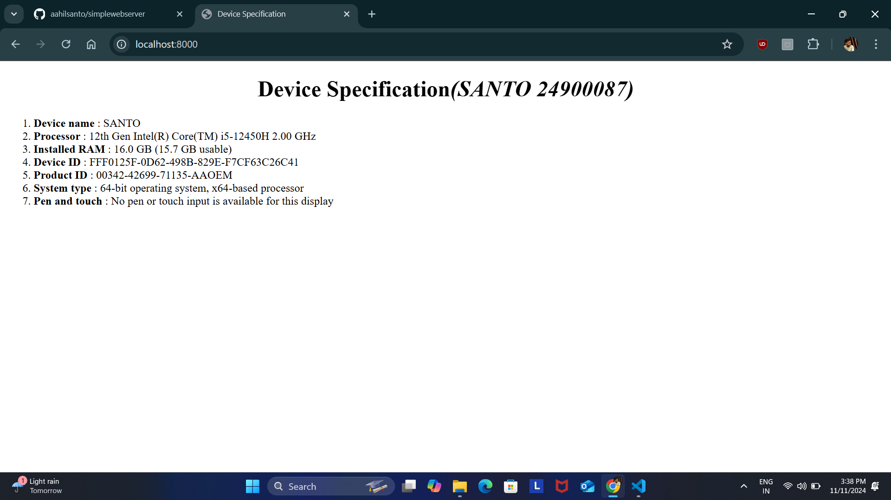

# EX01 Developing a Simple Webserver
## Date:15.10.24

## AIM:
To develop a simple webserver to serve html pages and display the configuration details of laptop.

## DESIGN STEPS:
### Step 1: 
HTML content creation.

### Step 2:
Design of webserver workflow.

### Step 3:
Implementation using Python code.

### Step 4:
Serving the HTML pages.

### Step 5:
Testing the webserver.

## PROGRAM:
```

from http.server import HTTPServer, BaseHTTPRequestHandler
content = """
<!DOCTYPE html>
<html>
    <title>
        Device Specification
    </title>
    <body>
        <h1 align="center"> Device Specification<i>(SANTO 24900087)</i></h1>
        <ol>
            <li><b>Device name</b> : SANTO</li>

            <li><b>Processor</b> : 12th Gen Intel(R) Core(TM) i5-12450H 2.00 GHz</li>

            <li><b>Installed RAM</b> : 16.0 GB (15.7 GB usable)</li>

            <li><b>Device ID</b> : FFF0125F-0D62-498B-829E-F7CF63C26C41</li>

            <li><b>Product ID</b> : 00342-42699-71135-AAOEM</li>

            <li><b>System type</b> : 64-bit operating system, x64-based processor</li>

            <li><b>Pen and touch</b> : No pen or touch input is available for this display</li>
        </ol>
    </body>
</html>
"""
class myhandler(BaseHTTPRequestHandler):
    def do_GET(self):
        print("request received")
        self.send_response(200)
        self.send_header('content-type', 'text/html; charset=utf-8')
        self.end_headers()
        self.wfile.write(content.encode())
server_address = ('',8000)
httpd = HTTPServer(server_address,myhandler)
print("my webserver is running...")
httpd.serve_forever()

```
## OUTPUT:




## RESULT:
The program for implementing simple webserver is executed successfully.
